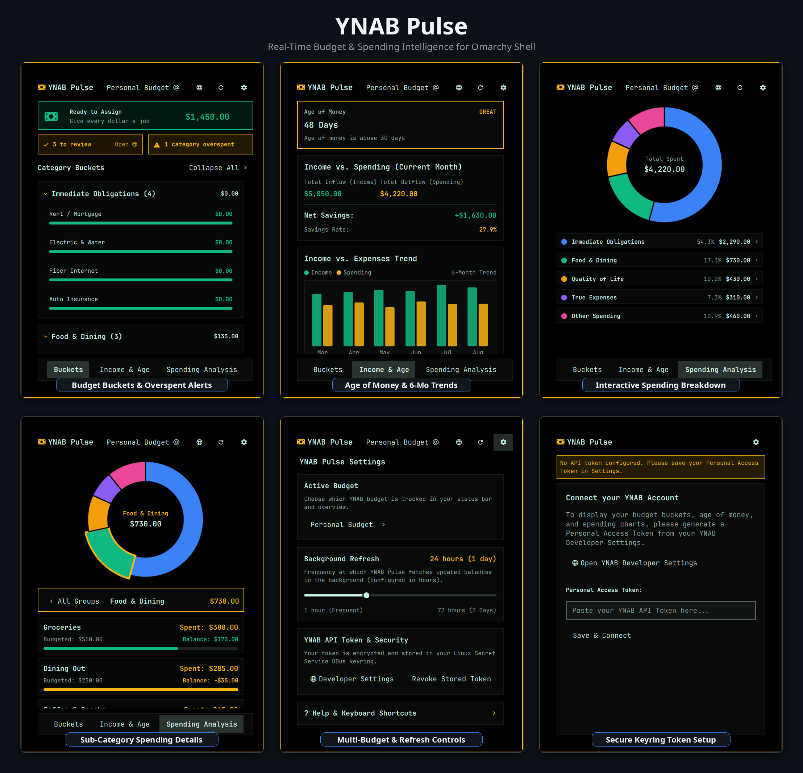

# YNAB Pulse (Omarchy Plugin)

A fast, private, and beautiful **You Need A Budget (YNAB)** companion for the Omarchy Linux desktop shell.

- **Plugin Name**: `YNAB Pulse`
- **Plugin ID**: `io.github.elevate08.ynab-glance`



---

## Key Features

- **At-a-Glance Budget Buckets**:
  - **Ready to Assign Banner**: Displays current available funds to assign with quick-launch to YNAB.
  - **Action Alerts**: Live pill badges highlighting unapproved transactions to review and overspent categories.
  - **Category Buckets & Progress**: Collapsible category groups with progress bars adhering to official YNAB conventions (Green funded, Amber/Yellow underfunded, Red overspent).
- **Income, Age of Money & 6-Month Trend Graph**:
  - **Age of Money Tracker**: Days metric with status health badge.
  - **Current Month Inflow vs. Outflow**: Total Income, Spending, Net Savings, and Savings Rate %.
  - **Multi-Month Historical Trends**: Side-by-side Income vs. Spending dual-bar chart with interactive hover tooltips across the last 6 months.
- **Interactive Spending Analysis**:
  - **Doughnut Pie Chart**: High-DPI canvas visualization of monthly expenses by Category Group.
  - **Category Group Drill-Down**: Click any pie slice or group row to drill down into sub-category spending outflows, budgeted amounts, remaining balances, and progress bars.
- **Fast & Private Rust Backend**:
  - Sub-millisecond execution with native caching and zero Python runtime dependencies.
  - **Encrypted Linux Keyring**: Stores your Personal Access Token in the Linux Secret Service (`org.freedesktop.secrets` / GNOME Keyring / KWallet).
- **Settings & Multi-Budget Management**:
  - **Active Budget Selector**: Full-width dropdown to switch between multiple budgets instantly.
  - **Background Refresh Interval Slider**: Easily configure background polling from 1 to 72 hours directly inside the UI.
  - **Keyring Token Management**: Check connection status, access developer settings, or revoke tokens safely.

---

## Keyboard Shortcuts

All navigation and actions can be operated entirely via keyboard with the `Alt` modifier:

| Shortcut | Action |
| :--- | :--- |
| **`Alt+1`** / **`Alt+B`** | Switch to **Buckets** tab (Budget categories & overspent alerts) |
| **`Alt+2`** / **`Alt+I`** | Switch to **Income & Age** tab (Age of money & 6-month trends) |
| **`Alt+3`** / **`Alt+P`** | Switch to **Spending Analysis** tab (Pie chart breakdown) |
| **`Alt+D`** | Toggle **Spending Drill-down** (inspect sub-category details) |
| **`Alt+M`** / **`Alt+U`** | Open **Active Budget Selector** dropdown |
| **`Alt+S`** / **`Alt+,`** | Toggle **Settings** panel (slider, budgets, security) |
| **`Alt+R`** | Trigger immediate **Force Refresh** from YNAB |
| **`Alt+W`** / **`Alt+O`** | Launch **YNAB Web App** in your default browser |
| **`Alt+C`** / **`Enter`** | Save & Connect token on the onboarding screen |
| **`Escape`** | Step back from drill-down / close dropdown / close panel |

---

## Status Bar Mouse Controls

- **Left-Click**: Toggle open/close the YNAB Pulse panel.
- **Middle-Click**: Trigger an immediate background fetch from YNAB.
- **Right-Click**: Send a desktop notification summary with Ready to Assign and Age of Money.

---

## Installation & Setup

1. **Install the Plugin**:
   Clone or copy this repository into your Omarchy plugins directory:
   ```bash
   mkdir -p ~/.config/omarchy/plugins
   cp -r /path/to/qs-ynab-api ~/.config/omarchy/plugins/io.github.elevate08.ynab-glance
   ```

2. **Build the Backend Helper**:
   ```bash
   cd ~/.config/omarchy/plugins/io.github.elevate08.ynab-glance
   ./build.sh
   ```

3. **Add Widget to Omarchy Bar**:
   Add `io.github.elevate08.ynab-glance` to your bar configuration in `~/.config/omarchy/shell.json`:
   ```json
   {
     "bar": {
       "sections": {
         "right": [
           "io.github.elevate08.ynab-glance"
         ]
       }
     }
   }
   ```

4. **Connect your YNAB Account**:
   - Generate a Personal Access Token in [YNAB Account Settings > Developer](https://app.ynab.com/settings/developer).
   - Click the bar widget, paste your token, and click **Save & Connect**.

---

## Demo & Testing

To run automated screenshot captures and rebuild the README preview collage using mock fixture data:

```bash
./demo/capture.sh
/usr/bin/python3 demo/make_collage.py
```

---

## Security Model

- **Zero Plaintext Secrets**: Personal Access Tokens are stored exclusively in the system's encrypted Secret Service.
- **POSIX Cache Hardening**: Local offline cache files in `~/.cache/omarchy/ynab-glance/` use strict `0600` permissions and directory `0700`.
- **Minimal Network Surface**: Direct HTTPS requests to `https://api.ynab.com/v1/` with TLS 1.3 verification and timeout protection.

---

## License

MIT License. See [LICENSE](LICENSE) for details.
